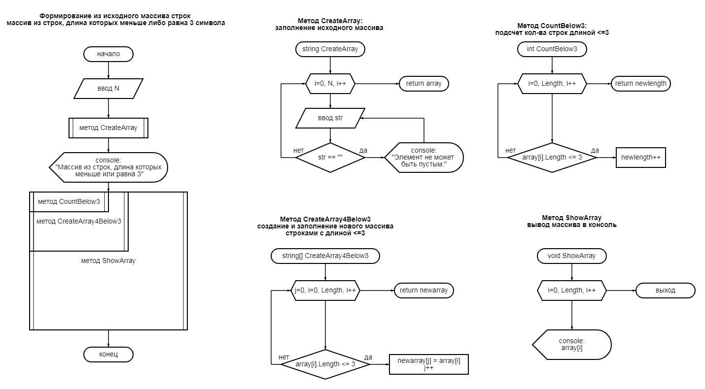

# Задача
Написать программу, которая из имеющегося массива строк формирует
массив из строк, длина которых меньше либо равна 3 символа. 
Первоначальный массив можно ввести с клавиатуры, либо задать на старте
выполнения алгоритма.

# Описание решения
Алгоритм описывается блок схемой

На начальном этапе у пользователя запрашивается кол-во элементов строк массива.

Далее задается массив указанного размера и в методе *CreateArray* запрашивается у пользователя и производится заполнение массива строками. При этом осуществляется проверка на ввод пустого элемента. В случае ввода пустого элемента(строки) у пользователя производится повторный запрос с указанием, что строка не может быть пустой. Из метода возвращается заполненный массив.

Далее, в методе *CountBelow3* производится подсчет кол-ва строк, удовлетворяющих условию длины меньшей либо равной 3. Из метода возвращается новая величина(размер) массива. 

В методе *CreateArray4Below3* задается новый массив с величиной, полученной в методе *CountBelow3* и производится его заполенение строками из исходного массива, удовлетворяющих условию длины меньшей либо равной 3.

Далее, в методе *ShowArray* производится вывод в консоль элементов (строк) массива.

Вызов методов *ShowArray*, *CreateArray4Below3*, *CountBelow3* осуществляется вложенно, один из другого, поскольку возвращаемые данные являются  исходными для других методов.